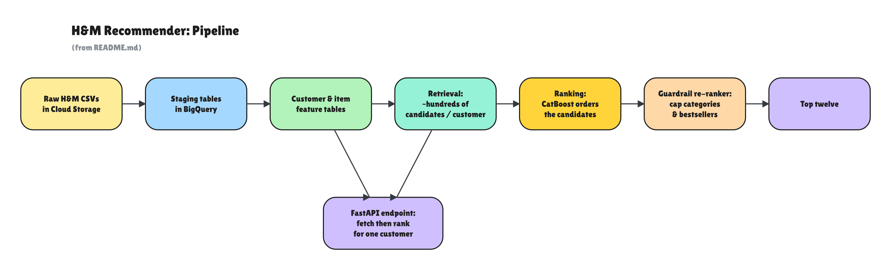
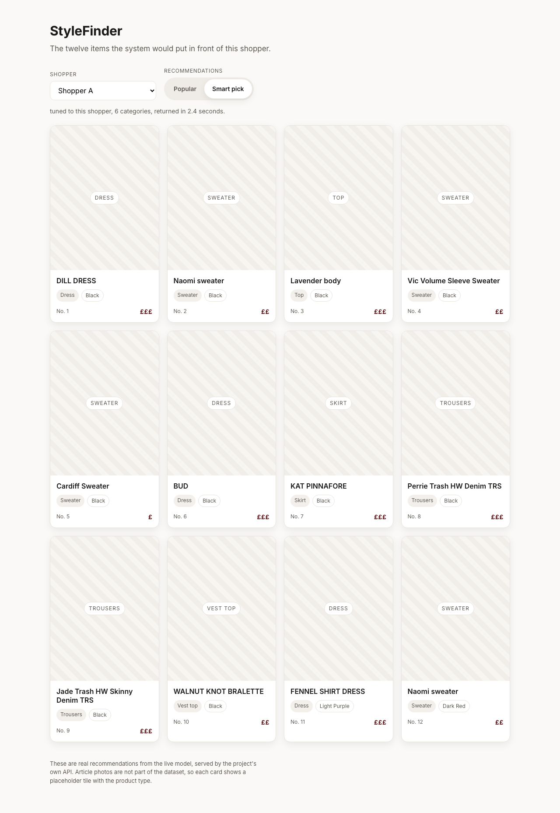
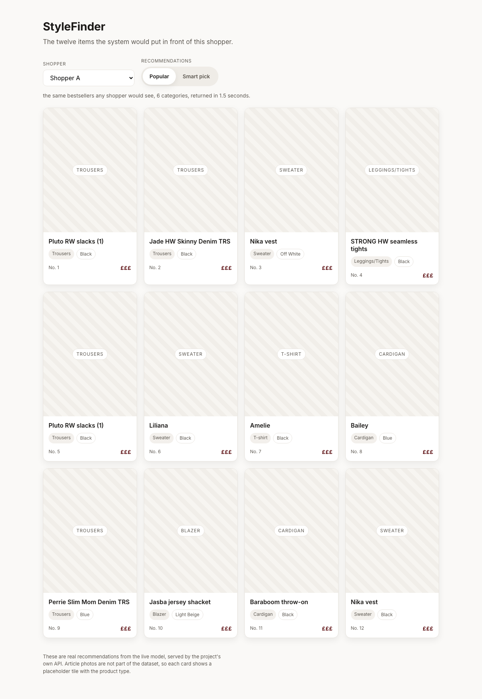
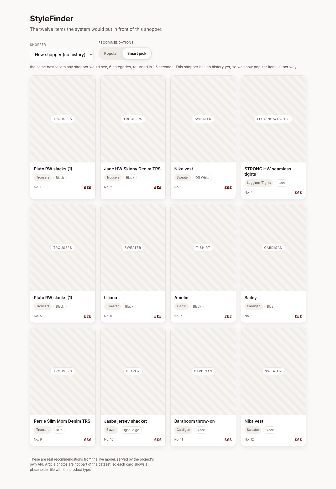
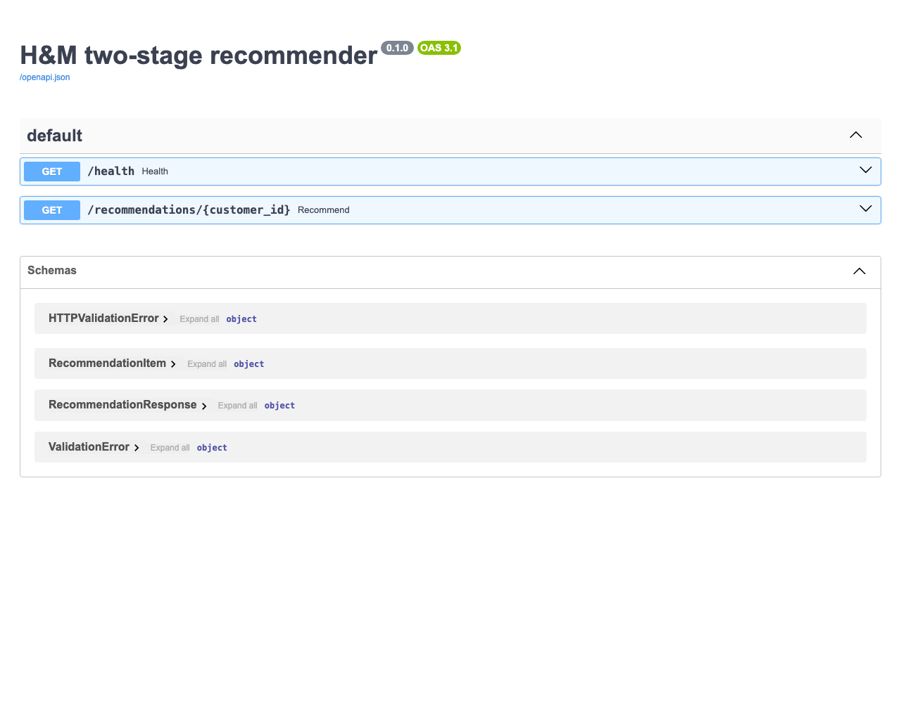

# H&M two-stage fashion recommender

An online clothing shop has far more products than it can ever put in front of one person. A customer sees a handful of slots on a page, and behind those slots are about a hundred thousand items. The work is to fill those few slots with things this particular shopper might want, and to do it without falling back on the same bestsellers for everyone. This project does that on H&M shopping data, roughly 31 million purchases, and it runs end to end with one command.

It works in two passes, the way a good shop assistant might. The first pass is quick and a little rough: it narrows a hundred thousand products down to a few hundred that are plausible for you, using cheap signals like what you have bought before and what people who bought those same things went on to buy. The second pass is slower and more careful: it scores those few hundred and keeps the best twelve. Narrowing first is what keeps the careful step small enough to train and run on a laptop. It also checks that list for variety, so a customer does not get twelve near-identical black tops, and it measures the whole pipeline against the plain alternative of showing whatever is popular this week.

## Documentation map

| Document | If you're wondering... |
|---|---|
| [README.md](README.md) (this file) | What is this, what did it find, and how do I run it? |
| [docs/ARCHITECTURE.md](docs/ARCHITECTURE.md) | How do the pieces fit together, and why this shape? |
| [docs/RESULTS.md](docs/RESULTS.md) | What did it produce, and how was it measured? |
| [docs/MODELS.md](docs/MODELS.md) | Why these models, and why CatBoost over the alternative? |
| [docs/MODEL_CARD.md](docs/MODEL_CARD.md) | What is the ranker for, trained on what, weak where? |
| [docs/DATASET.md](docs/DATASET.md) | What data is this on, and how is leakage kept out? |
| [docs/TROUBLESHOOTING.md](docs/TROUBLESHOOTING.md) | How were the hard bugs found and fixed? |
| [docs/LESSONS_LEARNED.md](docs/LESSONS_LEARNED.md) | What went wrong, what surprised me, what would I change? |
| [docs/GLOSSARY.md](docs/GLOSSARY.md) | What do these terms mean? |
| [docs/SETUP.md](docs/SETUP.md) | How do I set up GCP, BigQuery, and the data from scratch? |
| [docs/experiment_design.md](docs/experiment_design.md) | What online test would this offline work stand in for? |

## What it does

The project is built as two stages with a few supporting pieces around them.

- Retrieval, in BigQuery SQL. For each customer it generates a few hundred candidate articles from cheap signals: recent top sellers globally and per age band, items the customer bought before, item-to-item co-purchase, other colours and sizes of recent buys, and recent sellers in the customer's main category.
- Ranking, in Python. A CatBoost learning-to-rank model orders each customer's candidates using features built in BigQuery. Learning to rank means the model is trained to get the order of a short list right, which is what a row of recommendation slots actually needs, rather than scoring each item on its own.
- Guardrails, in Python. A re-ranking step that caps how many items can come from one product group and how many bestsellers a list may hold, so variety can be turned up and the cost of doing so can be read off a curve.
- Evaluation, in Python. A strict time-based split, ranking metrics, and a small experiment harness with bootstrap confidence intervals.
- Serving, in Python with FastAPI. One endpoint that returns the top twelve for a customer with its response time logged.

The headline number: the learned ranker reaches MAP@12 of 0.0292 on a held-out future week, against 0.0053 for a recent-popularity baseline.

## Built with


BigQuery for cheap set operations at 31 million row scale, Python and CatBoost for the ranker that does not fit the warehouse free tier, FastAPI for a typed serving endpoint, and ruff, mypy, and pytest to keep the code clean.

## How it fits together



The split between the warehouse and Python is deliberate. BigQuery is cheap and quick at set operations over tens of millions of rows, which is exactly what candidate generation and feature aggregation are. The ranking model does not belong there, because the matrix-factorisation tools inside BigQuery need a paid slot reservation, so the model is in Python where it stays free and trains in minutes.

One retrieval choice is worth naming. The first stage finds candidates with SQL co-purchase counts rather than a learned nearest-neighbour search over embeddings. At this scale, and on the free BigQuery tier, co-purchase counts are a cheap and accurate way to find plausible items, and they need no extra serving infrastructure. A learned embedding retrieval, the two-tower model sketched under scope and limits, would likely raise the candidate recall ceiling, and it is the natural next thing to try.

## Trade-offs

This project is set up to reason about four trade-offs, each backed by a number it produces.

- Whether the learned ranker earns its cost. A ranking model is more work than sorting by popularity, so it only earns its place if it wins by enough to matter. Here it does, by a wide and clear margin.
- What variety costs. Forcing a list to be varied usually costs some measured accuracy. The trade-off curve puts a number on it instead of leaving it as a claim.
- How concentrated the recommendations are. A system can score well and still pile everyone onto the same few bestsellers. Coverage, a Gini measure, and the long-tail share show how spread out the picks are across the catalogue.
- Whether all customers are served equally. A strong overall number can hide a group that is served poorly. Breaking MAP@12 out by age band, and by whether a customer has any history at all, surfaces that before it reaches anyone.

The thread running through all four is the tension between relevance and variety. A model tuned only to hit rate tends to collapse onto popular items, and the guardrail and the curve are how this project measures what pulling it back towards variety actually costs.

## Results

All numbers are on a held-out future week. The model trains on everything up to a cutoff date and predicts the next seven days, measured on customers it never saw in training.

| model | MAP@12 | Recall@12 | NDCG@12 |
|---|---|---|---|
| recent popularity | 0.0053 | 0.0189 | 0.0108 |
| item-to-item co-purchase | 0.0086 | 0.0237 | 0.0148 |
| CatBoost ranker | 0.0292 | 0.0692 | 0.0458 |

The ranker beats the popularity baseline on MAP@12 by 0.0239, with a 95% bootstrap confidence interval of 0.0219 to 0.0259, so the win is well clear of zero.

The diversity guardrail trades accuracy for variety along this curve. The cap is the largest number of items allowed from any one product group, and intra-list diversity is how different the items in a list are from each other.

| items per category | MAP@12 | intra-list diversity |
|---|---|---|
| 12 (cap off) | 0.0292 | 0.698 |
| 6 | 0.0288 | 0.738 |
| 4 | 0.0282 | 0.775 |
| 3 | 0.0273 | 0.793 |
| 2 | 0.0260 | 0.801 |
| 1 | 0.0252 | 0.770 |

Tightening the cap from off to two raises variety from 0.698 to 0.801 and reduces MAP@12 from 0.0292 to 0.0260, about an eleven percent reduction, which is the cost of variety stated as a number. Pushing to one item per category makes both worse, because demanding twelve different product groups empties many customers' candidate pools, so two per category is the sweet spot.

One note on the metric. MAP@12 is the measure the H&M competition used, which keeps these numbers comparable to that benchmark. On data with a lot of repeat buying, it does not cleanly separate recommending something a customer would have bought again anyway from surfacing something new to them.

The pipeline writes two charts to `reports/` when it runs: `model_comparison.png` and `tradeoff_curve.png`.

## How to run

You need Python 3.13, the Google Cloud SDK, a Google Cloud project with BigQuery, and the three H&M CSV files staged in a Cloud Storage bucket (transactions, articles, and customers). Settings come from a `.env` file, documented in `.env.example`.

```bash
make install   # create the virtual environment and install everything
make auth       # one-time login to BigQuery (Application Default Credentials)
make all        # build the whole pipeline: ingest, features, retrieval, train, evaluate, guardrails
make serve      # start the recommendations endpoint
```

`make all` runs the pipeline end to end and leaves the results table and the two charts in `reports/`. `make serve` starts the demo and the endpoint on http://127.0.0.1:8000.

## Interactive demo

`make serve` starts the page. Open http://127.0.0.1:8000/demo/ and click through the recommendations.

Pick a shopper, then toggle between Popular and Smart pick. Popular is the bestseller list every shopper would see. Smart pick is the learned ranker tuned to that shopper. Switching between the two is the whole idea in one view, because you watch a generic list become a personal one. A fourth shopper has no purchase history, so the page shows the cold-start fallback and says so. The H&M data ships without article photos, so each card uses a placeholder tile labelled with the product type.





Behind the page, the same recommendations are a typed JSON API, with interactive docs that FastAPI builds from the response models.



The response reports `served_by` (ranker, popularity, or popularity_fallback), `cold_start`, `n_candidates`, and `latency_ms`. One note on that latency. Each request does a BigQuery feature fetch, so a first call takes a couple of seconds. A production deployment would read precomputed features from a fast store and would precompute the co-purchase score this query derives at request time. The endpoint shows the two-stage online path, and a production system would carry the throughput.

## Cost and complexity

The main stages and what drives their cost. Let `N` be transactions (about 31.8 million), `U` customers, `I` articles (about 105,000), `C` candidates per customer (about 580), `K` the list length (12), and `F` the ranker features (29). The full table, with the space column and measured runtimes, is in [docs/ARCHITECTURE.md](docs/ARCHITECTURE.md).

| Stage | Time | What drives it |
|---|---|---|
| Load and staging | `O(N)` | one linear pass over the transactions |
| Feature build | `O(N)` | grouped aggregation down to one row per customer and per item |
| Co-purchase self-join | `O(sum of basket_size^2)` over the window | item pairs in the same basket, bounded by small baskets (about 0.35 GB scanned) |
| Ranking inference | `O(U * C * F)` | scoring `C` candidates over `F` features per customer |
| Greedy re-rank | `O(C * K)` per customer | each of `K` picks scans the remaining candidates |

Everything stays inside the BigQuery free tier. Every query runner sets `maximum_bytes_billed` from config, so a cost mistake fails instead of billing. One served request takes a couple of seconds, almost all of it a BigQuery feature fetch made at request time.

## Scope and limits

- The experiments are offline. There is no live traffic, so every result is a replay against a hidden week of held-out shoppers.
- The serving endpoint demonstrates the architecture and reports a measured response time. Most of its few seconds per request is a BigQuery feature fetch made at request time, which a production deployment would serve from a fast store.
- The two-tower retrieval model is future work. The file is a typed stub, not a trained model, and the SQL retrieval is what runs today.
- The H&M price column is a scaled relative index, so any price feature here compares items to each other in place of an amount in pounds or euros.

## What I would change next

- Make the runs reproducible to the last digit by adding a tie-breaker to the top-N retrieval selections, so the headline number stops drifting a few percent between full re-runs.
- Precompute the serving features into a fast store, which would turn the couple-of-seconds request into milliseconds. Most of the current latency is the BigQuery fetch.
- Build the two-tower retrieval model, a typed stub today, since the candidate recall ceiling sets the limit on the score.
- Give cold customers more than a single popularity list, using a light cold-profile signal from age band and channel.

More of this, with what surprised me along the way, is in [docs/LESSONS_LEARNED.md](docs/LESSONS_LEARNED.md).

## Repo map

| Path | What is in it |
|---|---|
| `core/` | configuration, logging, custom errors, and the typed BigQuery client |
| `ingestion/` | load the raw CSVs from Cloud Storage and build the staging tables |
| `features/` | build the customer and item feature tables, with the leakage check |
| `sql/` | the SQL for staging, features, retrieval, and serving |
| `models/` | the popularity and co-purchase baselines, the CatBoost ranker, the cold-start fallback, and training |
| `eval/` | ranking metrics and the experiment harness with confidence intervals |
| `guardrails/` | the beyond-accuracy metrics and the diversity re-ranker |
| `serving/` | the FastAPI endpoint and the static demo page (`serving/static/`) |
| `tests/` | unit tests for the metrics, the re-ranker, and the transforms |
| `notebooks/` | scratch exploration only, never imported by the pipeline |
| `docs/` | the decision log, the experiment design, the setup guide, and design notes |
| `reports/` | the model comparison table and the trade-off curve |
| `artifacts/` | the saved ranker and its feature list |
| `legacy/` | earlier analysis work, kept for history |
