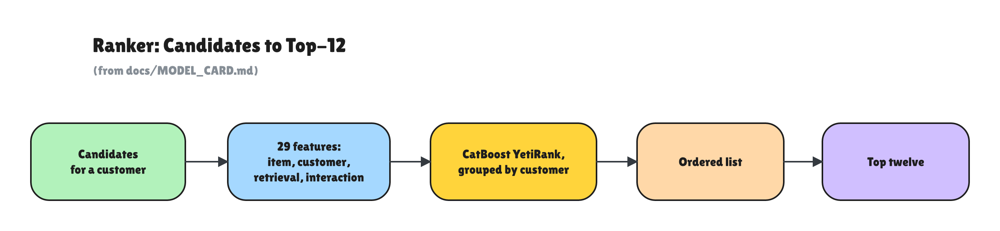

# Model card: H&M candidate ranker

## What it does

The model takes a customer's few hundred retrieved candidate articles and orders them, so the top twelve can be shown as recommendations. Its input is a row per candidate with customer, item, and retrieval features. Its output is a ranking of those candidates for that customer.

## Architecture

A CatBoost gradient-boosted-tree model with the YetiRank listwise objective, trained to order each customer's candidate list. Training data is grouped by customer (`group_id = customer_id`), so the model optimises the order within a list rather than a score per item. CatBoost handles the high-cardinality categoricals natively, so there is no manual encoding step.

The choice of CatBoost over LightGBM, and why, is explained in [MODELS.md](MODELS.md).

## Data

Trained on the H&M Personalized Fashion Recommendations dataset, about 31.8 million transactions over roughly two years. Full data notes are in [DATASET.md](DATASET.md). The split is time-based: features are computed strictly as of a cutoff date of 2020-09-15, and the labels come from the following week, 2020-09-16 to 2020-09-22. A leakage gate runs before training and confirms no feature uses data after the cutoff. The model trains on a 30,000-customer sample, and the test customers are reserved before training so they are never seen.

## Metrics

Measured on a held-out future week, on test customers the model never saw. MAP@12 is the primary metric, the same one the H&M competition used.

| model | MAP@12 | Recall@12 | NDCG@12 |
|---|---|---|---|
| recent popularity | 0.0053 | 0.0189 | 0.0108 |
| item-to-item co-purchase | 0.0086 | 0.0237 | 0.0148 |
| this ranker | 0.0292 | 0.0692 | 0.0458 |

The ranker beats the popularity baseline on MAP@12 by 0.0239, with a 95% bootstrap confidence interval of 0.0219 to 0.0259, so the win is well clear of zero. MAP@12 of about 0.03 is in range of the H&M competition leaders from a free-tier SQL and CatBoost pipeline. The full results, including the diversity trade-off curve and per-segment breakdowns, are in [RESULTS.md](RESULTS.md).

## Limitations

This is where the model is weak, stated plainly.

- **It cannot recommend what retrieval never found.** Candidate recall against the holdout week is about 0.25, so roughly three quarters of true next purchases are not in the candidate set at all. That is the ceiling on the score, and it is a retrieval limit, not a ranker limit. A learned embedding retrieval would likely raise it.
- **Cold customers get popularity, not personalisation.** A customer with no pre-cutoff history is served the popularity fallback, which is the same for everyone in that group. The model has nothing to personalise on for them.
- **It leans on popularity and recency.** The strongest features are recent popularity and recency, so the ranker is a popularity-plus-personalisation blend. On its own it is bestseller-heavy, which is exactly why the diversity guardrail exists.
- **Runs are not bit-for-bit reproducible.** The top-N selections in retrieval break ties in a way BigQuery does not fix, so the candidate set and the headline number move by a few percent between full re-runs. A recent run read MAP@12 0.0292 where an earlier one read 0.0305. The conclusion holds across runs.
- **Prices are relative.** The price features come from a scaled price index, so any price-based behaviour is relative.
- **It should not be used as a live production model.** Serving does a BigQuery fetch per request and takes a couple of seconds, which demonstrates the path, not production throughput.
