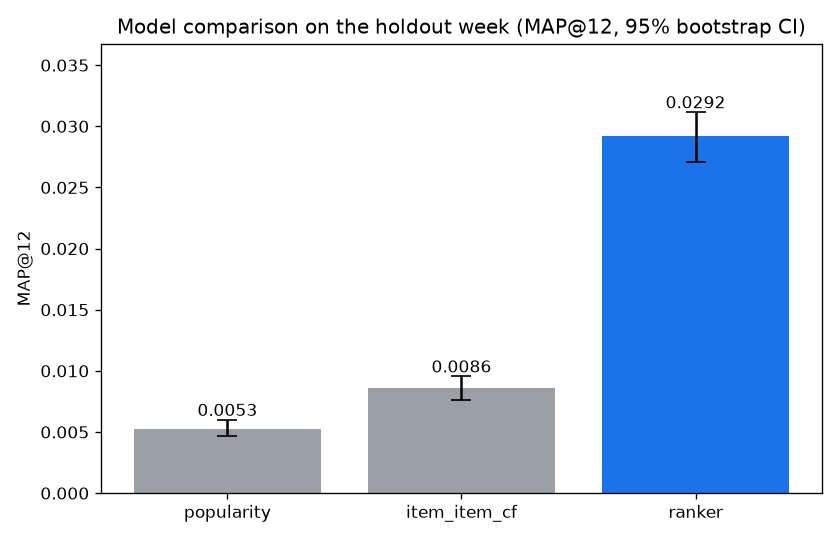
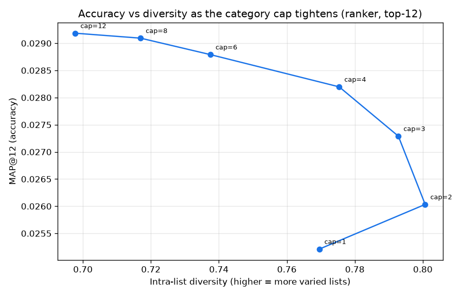

# Results

All numbers here come from one end-to-end run of the pipeline. The charts referenced live in `reports/`, which the run regenerates. A note on how the numbers were measured comes first, because the measurement is most of what makes them trustworthy.

## How it is measured

The split is by time. The model trains on everything up to a cutoff date of 2020-09-15 and is scored on the following week, 2020-09-16 to 2020-09-22. The test customers, 13,797 of them, are reserved before training, so the model never sees them. Every feature is computed strictly as of the cutoff, and a gate checks this before training runs, because one full-dataset aggregate would inflate the score. The full reasoning is in [DATASET.md](DATASET.md).

The primary metric is MAP@12, the same one the H&M competition used, alongside Recall@12 and NDCG@12. The lift of the ranker over the popularity baseline comes with a 95% bootstrap confidence interval, found by resampling the test customers many times, so the win is shown to be more than noise. The online test this offline harness stands in for is written up in [experiment_design.md](experiment_design.md).

## Model comparison

| model | MAP@12 | Recall@12 | NDCG@12 |
|---|---|---|---|
| recent popularity | 0.0053 | 0.0189 | 0.0108 |
| item-to-item co-purchase | 0.0086 | 0.0237 | 0.0148 |
| CatBoost ranker | 0.0292 | 0.0692 | 0.0458 |

The ranker beats popularity on MAP@12 by 0.0239, with a 95% bootstrap confidence interval of 0.0219 to 0.0259 and a p-value of essentially zero, which is about a five-and-a-half times improvement. Item-to-item co-purchase sits in between, which is what a collaborative-filtering baseline should do.

A word on the absolute size. MAP@12 of 0.03 looks small, but it is in range of the H&M competition leaders, who scored around 0.035, and it comes from a free-tier SQL and CatBoost pipeline. Next-week purchase prediction on this data is intrinsically hard.

## The accuracy and variety trade-off

The diversity guardrail re-ranks the ranker's top candidates under a cap on how many items may come from any one product group. Tightening the cap buys variety and costs accuracy. The curve puts a number on the exchange.

| items per category | MAP@12 | intra-list diversity |
|---|---|---|
| 12 (cap off) | 0.0292 | 0.698 |
| 8 | 0.0291 | 0.717 |
| 6 | 0.0288 | 0.738 |
| 4 | 0.0282 | 0.775 |
| 3 | 0.0273 | 0.793 |
| 2 | 0.0260 | 0.801 |
| 1 | 0.0252 | 0.770 |

Going from no cap to two items per category raises variety from 0.698 to 0.801 and lowers MAP@12 from 0.0292 to 0.0260, about an eleven percent reduction. Pushing to one per category makes both worse, because demanding twelve different product groups empties many candidate pools and the list refills with what is left, so two per category is the sweet spot.

## Beyond accuracy

A list can score well and still be a poor experience, so the run also reports catalogue and exposure metrics per model.

| model | coverage | intra-list diversity | novelty | Gini | long-tail share |
|---|---|---|---|---|---|
| popularity | 0.0002 | 0.585 | 12.80 | 0.000 | 0.000 |
| item-item CF | 0.097 | 0.614 | 13.10 | 0.845 | 0.059 |
| ranker | 0.088 | 0.698 | 13.98 | 0.867 | 0.013 |

Popularity is the cautionary tale. It shows roughly the same global hits to everyone, so its coverage is almost zero and its Gini is zero, which is the failure mode the guardrails exist to surface. The ranker is the most varied and novel of the three, but it is bestseller-heavy, with a long-tail share of only about one percent. That tension is the whole reason for the guardrail and the curve above.

## Who is served well

A strong overall number can hide a group served poorly, so MAP@12 is broken out per group. The clearest cut is warm versus cold customers.

| cohort | popularity | item-item CF | ranker |
|---|---|---|---|
| warm | 0.0054 | 0.0090 | 0.0314 |
| cold | 0.0040 | 0.0040 | 0.0040 |

Cold customers read the same across all three models, because they all fall back to popularity for a customer with no history. The ranker's gain is on warm customers, where it has something to personalise on. The per-age-band breakdown is in `reports/segment_parity.csv`.

## A caveat on reproducibility

These numbers move by a few percent between full re-runs. An earlier run read a ranker MAP@12 of 0.0305 where this one reads 0.0292. The cause is tie-breaking in the top-N retrieval selections, which BigQuery does not resolve the same way each time, so the candidate set and the warm-cold split shift slightly. The conclusion is steady across runs. The fix is explicit tie-breakers in the retrieval SQL.
